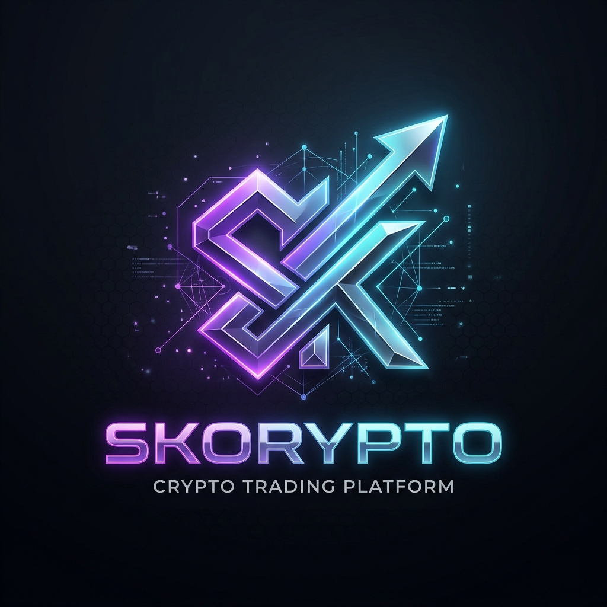
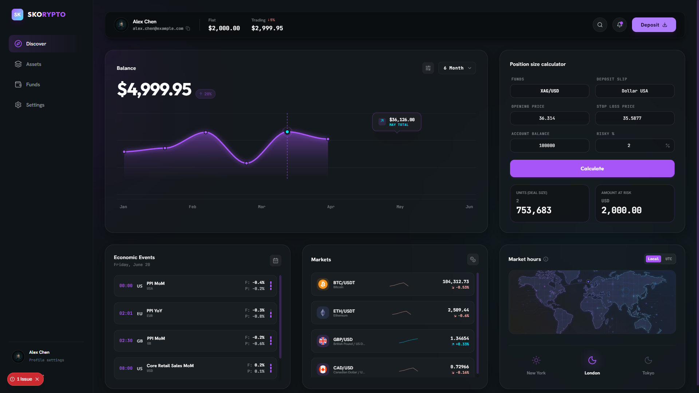

<div align="center">



# Skorypto

**A premium glassmorphic crypto trading simulator**

[](https://skoryto.vercel.app)
[](https://nextjs.org)
[](https://supabase.com)
[](https://www.typescriptlang.org)

</div>

---

## Overview

Skorypto is a fully-featured crypto portfolio simulator with a dark, glassmorphic UI. It lets users sign up, explore live market prices, manage a simulated portfolio of assets, deposit funds, track P&L, and customize their profile — all persisted securely via Supabase.



> **Note:** This is a simulator. No real funds are involved. All balances, trades, and holdings are virtual.

---

## ✨ Features

### 🔐 Authentication
- Email/password sign-up and sign-in via Supabase Auth
- Automatic profile record creation on first login
- Starter portfolio seeding for new users (pre-filled virtual balances)

### 📊 Dashboard & Market Data
- Live prices for **BTC, ETH, SOL, GBP/USD, CAD/USD** sourced from CoinGecko & Frankfurter
- Server-side market proxy at `/api/markets` — avoids CORS issues and keeps API keys server-only
- Sparkline charts, price change indicators, and market-hours widgets

### 💼 Portfolio & Assets
- View all held assets with current values and P&L
- Deposit simulator syncs fiat and trading balances in real time
- Asset holdings persisted per-user in Supabase (`user_assets` table)

### 🔍 Discover View
- Browse popular coins with live prices and real token logos
- Filterable and searchable coin list

### ⚙️ Settings & Profile
- Edit display name, avatar, and account info
- Notification preferences, mock API key manager
- Responsive glassmorphic settings panel

### 🎨 UI/UX
- Dark glassmorphic design system with purple/violet accents
- Smooth animations powered by **Framer Motion**
- Fully responsive layout with a collapsible sidebar and sticky navbar

---

## 🏗️ Tech Stack

| Layer | Technology |
|---|---|
| Framework | [Next.js 15](https://nextjs.org) (App Router) |
| Language | [TypeScript 5](https://www.typescriptlang.org) |
| UI Library | [React 19](https://react.dev) |
| Styling | [Tailwind CSS 4](https://tailwindcss.com) |
| Animations | [Framer Motion](https://www.framer.com/motion) |
| Icons | [Lucide React](https://lucide.dev) |
| Backend / Auth | [Supabase](https://supabase.com) (Auth + Postgres) |
| Market Data | [CoinGecko API](https://www.coingecko.com/en/api) + [Frankfurter API](https://frankfurter.dev) |
| Deployment | [Vercel](https://vercel.com) |

---

## 📁 Project Structure

```
src/
├── app/
│   ├── api/
│   │   └── markets/        # Server-side market data proxy
│   ├── globals.css          # Global design tokens & Tailwind base
│   ├── layout.tsx           # Root layout with metadata
│   └── page.tsx             # Main dashboard entry point
├── components/
│   ├── AuthOverlay.tsx      # Sign-in / Sign-up modal
│   ├── Navbar.tsx           # Top navigation bar (profile, balances, actions)
│   ├── Sidebar.tsx          # Collapsible left navigation
│   ├── DiscoverView.tsx     # Coin browser with live prices
│   ├── AssetsView.tsx       # Portfolio holdings & P&L
│   ├── FundsView.tsx        # Funds management panel
│   ├── DepositModal.tsx     # Deposit flow with balance sync
│   ├── SettingsView.tsx     # Profile & account settings
│   └── EconomicCalendarView.tsx
└── context/
    └── DashboardContext.tsx # Global state (auth, balances, market data)
```

---

## 🚀 Local Setup

### Prerequisites

- Node.js 18+
- A [Supabase](https://supabase.com) project

### 1. Clone & Install

```bash
git clone https://github.com/skouza101/crypto-platform.git
cd crypto-platform
npm install
```

### 2. Configure Environment Variables

Copy the example file and fill in your Supabase credentials:

```bash
cp .env.example .env.local
```

```env
# .env.local
NEXT_PUBLIC_SUPABASE_URL=https://<your-project-ref>.supabase.co
NEXT_PUBLIC_SUPABASE_PUBLISHABLE_KEY=<your-supabase-anon-key>
```

> Get these from **Supabase Dashboard → Project Settings → API**.

### 3. Set Up the Database

Run the schema in your Supabase SQL Editor:

```bash
# Copy contents of supabase-schema.sql and paste into Supabase SQL Editor
```

Or reference: [`supabase-schema.sql`](supabase-schema.sql)

The schema creates:

| Table | Purpose |
|---|---|
| `profiles` | Stores display name, avatar URL, fiat balance, trading balance |
| `user_assets` | Per-user crypto and fiat asset holdings |

Row Level Security (RLS) is enabled on both tables — users can only read and modify their own records.

### 4. Run the Dev Server

```bash
npm run dev
```

Open [http://localhost:3000](http://localhost:3000) in your browser.

---

## 🧪 Tester Account

Use this pre-seeded account to explore the app without signing up:

| Field | Value |
|---|---|
| Email | `skoryto.tester@gmail.com` |
| Password | `TestUser123!` |

> If sign-in fails with an email confirmation prompt, go to **Supabase Dashboard → Authentication → Users** and manually confirm the user.

---

## ☁️ Deployment (Vercel)

### Via Vercel Dashboard

1. Import your GitHub repository at [vercel.com/new](https://vercel.com/new)
2. Add environment variables under **Settings → Environment Variables**:

```env
NEXT_PUBLIC_SUPABASE_URL=https://<your-project-ref>.supabase.co
NEXT_PUBLIC_SUPABASE_PUBLISHABLE_KEY=<your-supabase-anon-key>
```

3. Deploy — Vercel auto-detects Next.js.

### Via CLI

```bash
npx vercel --prod --yes
```

> **Important:** After changing any `NEXT_PUBLIC_` variable in Vercel, you must **redeploy** — these values are baked into the client bundle at build time.

---

## 🛠️ Useful Commands

```bash
npm run dev       # Start the development server (http://localhost:3000)
npm run build     # Create a production build
npm run start     # Serve the production build locally
npm run lint      # Run ESLint
```

---

## 🔒 Security Notes

- **Never expose** the Supabase `service_role` key on the client side. Only the anon/publishable key belongs in `NEXT_PUBLIC_*` variables.
- All market data fetching is proxied through `/api/markets` to keep third-party API calls server-side.
- Row Level Security (RLS) is enforced at the database level — users can only access their own data regardless of client-side logic.
- `.env.local` is excluded from version control via `.gitignore`.

---

## 📄 License

This project is for educational and demonstration purposes. See [LICENSE](LICENSE) for details.

<div align="center">
  <sub>Built with ❤️ using Next.js & Supabase</sub>
</div>
